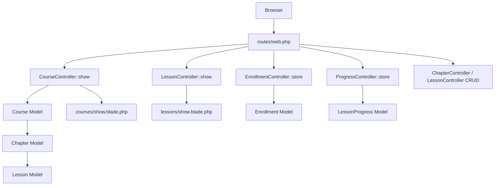

# Design Document: Course Content Structure

## Overview

This feature adds a course learning platform on top of the existing Laravel/AdminLTE application. It introduces a three-level content hierarchy (Course → Chapter → Lesson), an enrollment system, and a progress tracking system. The course detail page at `courses/show/{id}` is publicly browsable, but lesson content is gated behind enrollment. Admins and instructors manage content; students consume it.

The design follows the existing application conventions: Eloquent models, resource-style controllers, Blade views extending `master`, route groups with `auth`/role middleware, and AdminLTE UI components.

---

## Architecture



**Request flow for the course detail page:**
1. `CourseController::show` loads the course with eager-loaded chapters, lessons, and the authenticated user's enrollment/progress.
2. The view receives a `$course`, `$enrolled` boolean, and `$completedLessonIds` collection.
3. Lesson access is enforced in `LessonController::show` via a dedicated `InstructorOrAdmin` middleware and enrollment checks.

**Role model:** The existing `users.roles` column uses string values (`superAdmin`, `admin`, `user`). Two new values are added: `instructor` and `student`. The existing `admin` middleware is extended; a new `instructor` middleware is added.

---

## Components and Interfaces

### Middleware

| Middleware | File | Purpose |
|---|---|---|
| `auth` | existing | Require authentication |
| `admin` | existing (extended) | Allow admin/superAdmin/instructor |
| `instructor` | new | Allow admin/superAdmin/instructor only (management routes) |

### Controllers

**`CourseController`** — `app/Http/Controllers/CourseController.php`
- `index()` — list all published courses
- `show($id)` — course detail page (public)
- `create()`, `store()`, `edit($id)`, `update($id)`, `destroy($id)` — CRUD (instructor/admin only)

**`ChapterController`** — `app/Http/Controllers/ChapterController.php`
- `store(Request, $courseId)` — create chapter with auto display_order
- `edit($id)`, `update($id)`, `destroy($id)` — CRUD (instructor/admin only)
- `reorder(Request, $courseId)` — persist new display_order values

**`LessonController`** — `app/Http/Controllers/LessonController.php`
- `show($id)` — view lesson content (access-controlled)
- `store(Request, $chapterId)` — create lesson with auto display_order
- `edit($id)`, `update($id)`, `destroy($id)` — CRUD (instructor/admin only)
- `reorder(Request, $chapterId)` — persist new display_order values

**`EnrollmentController`** — `app/Http/Controllers/EnrollmentController.php`
- `store(Request, $courseId)` — enroll authenticated user in course

**`ProgressController`** — `app/Http/Controllers/ProgressController.php`
- `store(Request, $lessonId)` — mark lesson as complete for authenticated user

### Services

**`EnrollmentService`** — `app/Services/EnrollmentService.php`
- `enroll(User $user, Course $course): Enrollment` — creates enrollment record, idempotent (uses `firstOrCreate`)

### Views

```
resources/views/courses/
  index.blade.php       — course listing
  show.blade.php        — course detail page (main feature view)
  create.blade.php      — create/edit form (admin/instructor)
  edit.blade.php

resources/views/chapters/
  _form.blade.php       — inline create/edit form partial

resources/views/lessons/
  show.blade.php        — lesson content view
  _form.blade.php       — inline create/edit form partial
```

---

## Data Models

### Database Schema

```mermaid
erDiagram
    users ||--o{ courses : "instructor_id"
    courses ||--o{ chapters : "course_id"
    chapters ||--o{ lessons : "chapter_id"
    users ||--o{ enrollments : "user_id"
    courses ||--o{ enrollments : "course_id"
    users ||--o{ lesson_progress : "user_id"
    lessons ||--o{ lesson_progress : "lesson_id"

    courses {
        bigint id PK
        bigint instructor_id FK
        string title
        text description
        string thumbnail
        decimal price
        string difficulty
        int duration_minutes
        boolean is_published
        timestamps
    }
    chapters {
        bigint id PK
        bigint course_id FK
        string title
        text description
        int display_order
        timestamps
    }
    lessons {
        bigint id PK
        bigint chapter_id FK
        string title
        enum type
        int duration_minutes
        text content
        string video_url
        boolean is_preview
        int display_order
        timestamps
    }
    enrollments {
        bigint id PK
        bigint user_id FK
        bigint course_id FK
        timestamp enrolled_at
        timestamps
    }
    lesson_progress {
        bigint id PK
        bigint user_id FK
        bigint lesson_id FK
        timestamp completed_at
        timestamps
    }
```

### Migrations

**`create_courses_table`**
```php
Schema::create('courses', function (Blueprint $table) {
    $table->id();
    $table->foreignId('instructor_id')->constrained('users')->cascadeOnDelete();
    $table->string('title');
    $table->text('description')->nullable();
    $table->string('thumbnail')->nullable();
    $table->decimal('price', 8, 2)->default(0);
    $table->string('difficulty')->default('beginner'); // beginner, intermediate, advanced
    $table->unsignedInteger('duration_minutes')->default(0);
    $table->boolean('is_published')->default(false);
    $table->timestamps();
});
```

**`create_chapters_table`**
```php
Schema::create('chapters', function (Blueprint $table) {
    $table->id();
    $table->foreignId('course_id')->constrained()->cascadeOnDelete();
    $table->string('title');
    $table->text('description')->nullable();
    $table->unsignedInteger('display_order')->default(1);
    $table->timestamps();
});
```

**`create_lessons_table`**
```php
Schema::create('lessons', function (Blueprint $table) {
    $table->id();
    $table->foreignId('chapter_id')->constrained()->cascadeOnDelete();
    $table->string('title');
    $table->enum('type', ['video', 'article', 'pdf', 'quiz'])->default('video');
    $table->unsignedInteger('duration_minutes')->default(0);
    $table->text('content')->nullable();
    $table->string('video_url')->nullable();
    $table->boolean('is_preview')->default(false);
    $table->unsignedInteger('display_order')->default(1);
    $table->timestamps();
});
```

**`create_enrollments_table`**
```php
Schema::create('enrollments', function (Blueprint $table) {
    $table->id();
    $table->foreignId('user_id')->constrained()->cascadeOnDelete();
    $table->foreignId('course_id')->constrained()->cascadeOnDelete();
    $table->timestamp('enrolled_at')->useCurrent();
    $table->timestamps();
    $table->unique(['user_id', 'course_id']);
});
```

**`create_lesson_progress_table`**
```php
Schema::create('lesson_progress', function (Blueprint $table) {
    $table->id();
    $table->foreignId('user_id')->constrained()->cascadeOnDelete();
    $table->foreignId('lesson_id')->constrained()->cascadeOnDelete();
    $table->timestamp('completed_at')->useCurrent();
    $table->timestamps();
    $table->unique(['user_id', 'lesson_id']);
});
```

### Eloquent Models

**`Course`** — `app/Models/Course.php`
```php
class Course extends Model {
    protected $fillable = ['instructor_id','title','description','thumbnail','price','difficulty','duration_minutes','is_published'];

    public function instructor() { return $this->belongsTo(User::class, 'instructor_id'); }
    public function chapters()   { return $this->hasMany(Chapter::class)->orderBy('display_order'); }
    public function enrollments(){ return $this->hasMany(Enrollment::class); }

    public function getLessonCountAttribute(): int {
        return $this->chapters->sum(fn($c) => $c->lessons->count());
    }
}
```

**`Chapter`** — `app/Models/Chapter.php`
```php
class Chapter extends Model {
    protected $fillable = ['course_id','title','description','display_order'];

    public function course()  { return $this->belongsTo(Course::class); }
    public function lessons() { return $this->hasMany(Lesson::class)->orderBy('display_order'); }
}
```

**`Lesson`** — `app/Models/Lesson.php`
```php
class Lesson extends Model {
    protected $fillable = ['chapter_id','title','type','duration_minutes','content','video_url','is_preview','display_order'];

    public function chapter()  { return $this->belongsTo(Chapter::class); }
    public function progress() { return $this->hasMany(LessonProgress::class); }
}
```

**`Enrollment`** — `app/Models/Enrollment.php`
```php
class Enrollment extends Model {
    protected $fillable = ['user_id','course_id','enrolled_at'];

    public function user()   { return $this->belongsTo(User::class); }
    public function course() { return $this->belongsTo(Course::class); }
}
```

**`LessonProgress`** — `app/Models/LessonProgress.php`
```php
class LessonProgress extends Model {
    protected $fillable = ['user_id','lesson_id','completed_at'];

    public function user()   { return $this->belongsTo(User::class); }
    public function lesson() { return $this->belongsTo(Lesson::class); }
}
```

**`User` additions:**
```php
public function enrollments()     { return $this->hasMany(Enrollment::class); }
public function lessonProgress()  { return $this->hasMany(LessonProgress::class); }
public function taughtCourses()   { return $this->hasMany(Course::class, 'instructor_id'); }

public function isInstructorOrAdmin(): bool {
    return in_array($this->roles, ['admin', 'superAdmin', 'instructor']);
}
public function isEnrolledIn(Course $course): bool {
    return $this->enrollments()->where('course_id', $course->id)->exists();
}
```

---

## Routes

```php
// Public course browsing
Route::prefix('courses')->group(function () {
    Route::get('/', [CourseController::class, 'index'])->name('courses.index');
    Route::get('/show/{id}', [CourseController::class, 'show'])->name('courses.show');
});

// Authenticated student actions
Route::middleware('auth')->prefix('courses')->group(function () {
    Route::post('/{courseId}/enroll', [EnrollmentController::class, 'store'])->name('courses.enroll');
});

Route::middleware('auth')->prefix('lessons')->group(function () {
    Route::get('/{id}', [LessonController::class, 'show'])->name('lessons.show');
    Route::post('/{id}/complete', [ProgressController::class, 'store'])->name('lessons.complete');
});

// Admin / instructor management
Route::middleware(['auth', 'instructor'])->group(function () {
    Route::prefix('courses')->group(function () {
        Route::get('/create', [CourseController::class, 'create'])->name('courses.create');
        Route::post('/store', [CourseController::class, 'store'])->name('courses.store');
        Route::get('/edit/{id}', [CourseController::class, 'edit'])->name('courses.edit');
        Route::post('/update/{id}', [CourseController::class, 'update'])->name('courses.update');
        Route::post('/destroy/{id}', [CourseController::class, 'destroy'])->name('courses.destroy');
    });

    Route::prefix('chapters')->group(function () {
        Route::post('/store/{courseId}', [ChapterController::class, 'store'])->name('chapters.store');
        Route::get('/edit/{id}', [ChapterController::class, 'edit'])->name('chapters.edit');
        Route::post('/update/{id}', [ChapterController::class, 'update'])->name('chapters.update');
        Route::post('/destroy/{id}', [ChapterController::class, 'destroy'])->name('chapters.destroy');
        Route::post('/reorder/{courseId}', [ChapterController::class, 'reorder'])->name('chapters.reorder');
    });

    Route::prefix('lessons')->group(function () {
        Route::post('/store/{chapterId}', [LessonController::class, 'store'])->name('lessons.store');
        Route::get('/edit/{id}', [LessonController::class, 'edit'])->name('lessons.edit');
        Route::post('/update/{id}', [LessonController::class, 'update'])->name('lessons.update');
        Route::post('/destroy/{id}', [LessonController::class, 'destroy'])->name('lessons.destroy');
        Route::post('/reorder/{chapterId}', [LessonController::class, 'reorder'])->name('lessons.reorder');
    });
});
```

---

## Correctness Properties

*A property is a characteristic or behavior that should hold true across all valid executions of a system — essentially, a formal statement about what the system should do. Properties serve as the bridge between human-readable specifications and machine-verifiable correctness guarantees.*

### Property 1: Course page renders all required fields

*For any* published course record, the rendered course detail page HTML must contain the course title, description, instructor name, price, difficulty level, total duration, and each lesson's title, type, and duration.

**Validates: Requirements 1.1, 2.3**

---

### Property 2: Course page displays correct aggregate counts

*For any* course with any number of chapters and lessons, the counts displayed on the course detail page must exactly equal the actual chapter count and total lesson count in the database.

**Validates: Requirements 1.3**

---

### Property 3: Content displayed in ascending display_order

*For any* course with any set of chapters (each with any set of lessons), the chapters rendered on the course detail page must appear in strictly ascending `display_order`, and within each chapter the lessons must also appear in strictly ascending `display_order`.

**Validates: Requirements 2.1, 2.2**

---

### Property 4: Preview lessons are visually distinguished

*For any* lesson, the rendered HTML for a preview lesson must contain a visual marker (e.g., a "Preview" badge) that is absent from the rendered HTML of a non-preview lesson.

**Validates: Requirements 2.4**

---

### Property 5: Lesson access control by enrollment and preview status

*For any* lesson and any user, access to lesson content is granted if and only if at least one of the following is true: (a) the lesson is marked `is_preview = true`, or (b) the user is authenticated and enrolled in the lesson's course. All other combinations must result in either a redirect to login (unauthenticated) or an enrollment prompt (authenticated but not enrolled).

**Validates: Requirements 3.1, 3.2, 3.3, 3.4**

---

### Property 6: Enroll button visibility matches enrollment status

*For any* course and any authenticated user, the enroll button is displayed if and only if the user is not currently enrolled in that course.

**Validates: Requirements 4.1, 4.4**

---

### Property 7: Enrollment creates a persisted record

*For any* authenticated user and any course they are not yet enrolled in, submitting the enrollment form must result in exactly one `enrollments` record with the correct `user_id` and `course_id` existing in the database.

**Validates: Requirements 4.2**

---

### Property 8: Progress display accuracy

*For any* enrolled student with any subset of completed lessons, the progress percentage displayed on the course detail page must equal `(count of completed lessons / total lessons in course) * 100`, rounded to the nearest integer, and each completed lesson must be visually marked as complete.

**Validates: Requirements 5.1, 5.3, 5.4**

---

### Property 9: Marking a lesson complete creates a progress record

*For any* enrolled student and any lesson in their enrolled course, calling the mark-complete endpoint must result in a `lesson_progress` record with the correct `user_id` and `lesson_id` existing in the database (idempotent — calling it twice must not create duplicates).

**Validates: Requirements 5.2**

---

### Property 10: Edit controls visible only to admin or instructor

*For any* course detail page, edit controls (edit/delete buttons for course, chapters, and lessons) must be present in the rendered HTML if and only if the authenticated user has the `admin`, `superAdmin`, or `instructor` role.

**Validates: Requirements 6.1**

---

### Property 11: Default display order equals count plus one

*For any* course with N chapters, creating a new chapter must assign `display_order = N + 1`. *For any* chapter with M lessons, creating a new lesson must assign `display_order = M + 1`.

**Validates: Requirements 6.2, 6.3**

---

### Property 12: Display order persists after reorder

*For any* set of chapters or lessons with any permutation of display_order values, after submitting a reorder request the database must reflect the exact order values that were submitted.

**Validates: Requirements 6.4**

---

### Property 13: Management routes return 403 for non-admin/instructor users

*For any* course management route (create, store, edit, update, destroy, reorder for courses/chapters/lessons) and any authenticated user whose role is not `admin`, `superAdmin`, or `instructor`, the HTTP response must be 403.

**Validates: Requirements 6.5**

---

## Error Handling

| Scenario | Handling |
|---|---|
| Course not found (`courses/show/{id}`) | `findOrFail` → 404 via Laravel's default exception handler |
| Chapter/Lesson not found | `findOrFail` → 404 |
| Duplicate enrollment | `firstOrCreate` in `EnrollmentService` — silently idempotent, redirect with success |
| Duplicate progress record | `firstOrCreate` in `ProgressController` — idempotent |
| Unauthorized management access | `instructor` middleware → 403 |
| Unauthenticated lesson access | `auth` middleware → redirect to login |
| Validation failure (store/update) | Laravel `FormRequest` → redirect back with errors |

---

## Testing Strategy

### Dual Testing Approach

Both unit/feature tests and property-based tests are required. They are complementary:
- Feature tests cover specific examples, integration points, and edge cases.
- Property tests verify universal correctness across randomized inputs.

### Feature Tests (PHPUnit)

Located in `tests/Feature/`:

- `CourseDetailPageTest` — verifies the show page renders with correct data, returns 404 for missing courses, shows/hides enroll button correctly.
- `LessonAccessTest` — verifies redirect to login for guests on non-preview lessons, enrollment prompt for non-enrolled users, access granted for enrolled users, preview access for all.
- `EnrollmentTest` — verifies enrollment record creation, redirect with success message, idempotent re-enrollment.
- `ProgressTest` — verifies progress record creation, idempotent duplicate marking.
- `ManagementAccessTest` — verifies 403 for non-admin/instructor on all management routes.
- `DisplayOrderTest` — verifies default order assignment and reorder persistence.

### Property-Based Tests

Use **[Pest PHP](https://pestphp.com/)** with **[pest-plugin-faker](https://github.com/pestphp/pest-plugin-faker)** for data generation, or a dedicated PBT library such as **[eris](https://github.com/giorgiosironi/eris)** for PHP. Each property test runs a minimum of **100 iterations**.

Each test must be tagged with a comment in the format:
`// Feature: course-content-structure, Property {N}: {property_text}`

| Property | Test Description |
|---|---|
| P1 | Generate random courses with random chapters/lessons; assert rendered HTML contains all required fields |
| P2 | Generate courses with random chapter/lesson counts; assert displayed counts match DB counts |
| P3 | Generate chapters/lessons with shuffled display_order; assert rendered order is ascending |
| P4 | Generate random lessons with `is_preview` true/false; assert preview badge present/absent |
| P5 | Generate random lessons × user states (guest, non-enrolled, enrolled); assert correct access outcome |
| P6 | Generate random courses × user enrollment states; assert enroll button presence matches non-enrollment |
| P7 | Generate random user/course pairs; assert enrollment record exists after store |
| P8 | Generate enrolled students with random completed lesson subsets; assert percentage and visual markers correct |
| P9 | Generate enrolled students × lessons; assert progress record exists after mark-complete, no duplicates on repeat |
| P10 | Generate random users with random roles; assert edit controls present iff role is admin/superAdmin/instructor |
| P11 | Generate courses with N chapters / chapters with M lessons; assert new item gets display_order = count + 1 |
| P12 | Generate random order permutations; assert DB reflects submitted order after reorder |
| P13 | Generate random non-admin/instructor users; assert all management routes return 403 |
