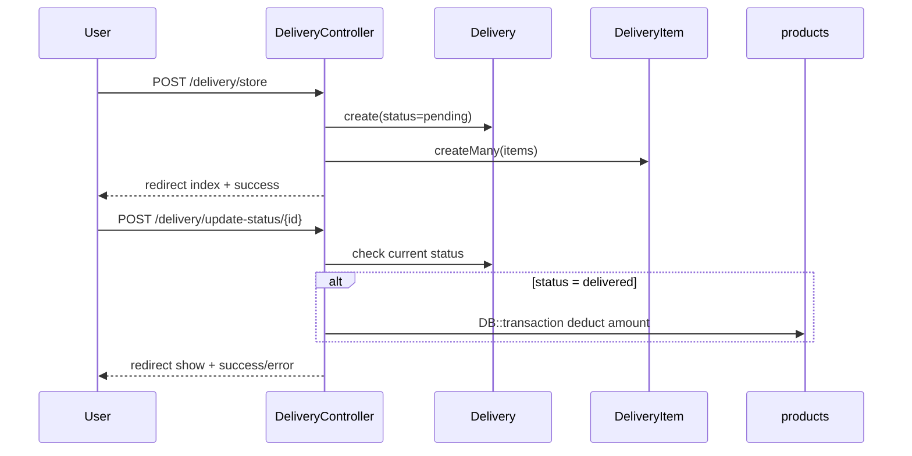

# Design Document: Delivery Process

## Overview

The Delivery Process feature adds outbound shipment management to the existing Laravel inventory system. It introduces two new Eloquent models (`Delivery` and `DeliveryItem`), a resource-style controller (`DeliveryController`), two Form Request classes, and a set of Blade views following the existing AdminLTE/Bootstrap conventions.

The feature integrates with the existing `Customer`, `products`, `User`, and `location` models. Stock deduction on delivery completion is performed inside a database transaction to guarantee consistency. All routes are protected by the existing `auth` and `admin` middleware.

---

## Architecture

The feature follows the same MVC pattern used throughout the application:

```
Routes (web.php)
  └── DeliveryController
        ├── Delivery (Model)  ←→  deliveries table
        └── DeliveryItem (Model)  ←→  delivery_items table
              └── products (existing Model)  ←→  products table
```



---

## Components and Interfaces

### Routes

Added to `routes/web.php` under `middleware(["auth", "admin"])->prefix("delivery")`:

| Method | URI | Name | Action |
|--------|-----|------|--------|
| GET | /delivery | delivery.index | index |
| GET | /delivery/create | delivery.create | create |
| POST | /delivery/store | delivery.store | store |
| GET | /delivery/{id} | delivery.show | show |
| GET | /delivery/edit/{id} | delivery.edit | edit |
| POST | /delivery/update/{id} | delivery.update | update |
| POST | /delivery/update-status/{id} | delivery.updateStatus | updateStatus |
| POST | /delivery/destroy/{id} | delivery.destroy | destroy |

### DeliveryController

`app/Http/Controllers/DeliveryController.php`

- `index(Request $request)` — returns DataTables JSON when AJAX, otherwise returns `delivery.index` view
- `create()` — returns `delivery.create` view with customers and products
- `store(StoreDeliveryRequest $request)` — validates, creates Delivery + DeliveryItems, redirects to index
- `show(string $id)` — returns `delivery.show` view with eager-loaded items
- `edit(string $id)` — returns `delivery.edit` view; aborts 403 if status is not `pending`
- `update(UpdateDeliveryRequest $request, string $id)` — updates delivery and items; aborts 403 if not `pending`
- `updateStatus(Request $request, string $id)` — transitions status; runs stock deduction in transaction when `delivered`
- `destroy(string $id)` — sets status to `cancelled`; aborts 403 if already `delivered` or `cancelled`

### Form Requests

**`StoreDeliveryRequest`** (`app/Http/Requests/StoreDeliveryRequest.php`):
```
customer_id   required|exists:customers,id
destination   required|string|max:255
items         required|array|min:1
items.*.product_id  required|exists:products,id
items.*.quantity    required|integer|min:1
```

**`UpdateDeliveryRequest`** (`app/Http/Requests/UpdateDeliveryRequest.php`):
```
customer_id   required|exists:customers,id
destination   required|string|max:255
items         required|array|min:1
items.*.product_id  required|exists:products,id
items.*.quantity    required|integer|min:1
```

### Blade Views

All views extend `master` and use AdminLTE card/table components:

- `resources/views/delivery/index.blade.php` — DataTables listing with status filter dropdown
- `resources/views/delivery/create.blade.php` — form with dynamic item rows (JS add/remove)
- `resources/views/delivery/edit.blade.php` — same form pre-populated; read-only if not pending
- `resources/views/delivery/show.blade.php` — detail view with items table and status update form

---

## Data Models

### `deliveries` table (new migration)

| Column | Type | Notes |
|--------|------|-------|
| id | bigIncrements | PK |
| customer_id | unsignedBigInteger | FK → customers.id |
| creater_id | unsignedBigInteger | FK → users.id |
| destination | string(255) | delivery address |
| status | enum('pending','in_transit','delivered','cancelled') | default: pending |
| in_transit_at | timestamp nullable | set when status → in_transit |
| delivered_at | timestamp nullable | set when status → delivered |
| cancelled_at | timestamp nullable | set when status → cancelled |
| timestamps | | created_at / updated_at |

### `delivery_items` table (new migration)

| Column | Type | Notes |
|--------|------|-------|
| id | bigIncrements | PK |
| delivery_id | unsignedBigInteger | FK → deliveries.id (cascade delete) |
| product_id | unsignedBigInteger | FK → products.id |
| quantity | unsignedInteger | must be > 0 |
| unit_price | decimal(10,2) | snapshot of products.price at creation time |
| timestamps | | created_at / updated_at |

### `Delivery` Model (`app/Models/Delivery.php`)

```php
protected $fillable = ['customer_id', 'creater_id', 'destination', 'status',
                        'in_transit_at', 'delivered_at', 'cancelled_at'];
protected $casts = ['in_transit_at' => 'datetime', 'delivered_at' => 'datetime',
                    'cancelled_at' => 'datetime'];

// Relationships
public function customer()   { return $this->belongsTo(Customer::class); }
public function creator()    { return $this->belongsTo(User::class, 'creater_id'); }
public function items()      { return $this->hasMany(DeliveryItem::class); }

// Helper
public function isEditable() { return $this->status === 'pending'; }
public function isFinal()    { return in_array($this->status, ['delivered', 'cancelled']); }
```

### `DeliveryItem` Model (`app/Models/DeliveryItem.php`)

```php
protected $fillable = ['delivery_id', 'product_id', 'quantity', 'unit_price'];

public function product() { return $this->belongsTo(products::class, 'product_id'); }
public function delivery() { return $this->belongsTo(Delivery::class); }
```

### Stock Deduction Logic (inside `updateStatus`)

```php
DB::transaction(function () use ($delivery) {
    foreach ($delivery->items as $item) {
        $product = products::lockForUpdate()->find($item->product_id);
        if ($product->amount < $item->quantity) {
            throw new \Exception("Insufficient stock for {$product->name}");
        }
        $product->decrement('amount', $item->quantity);
    }
    $delivery->update(['status' => 'delivered', 'delivered_at' => now()]);
});
```

---

## Correctness Properties

*A property is a characteristic or behavior that should hold true across all valid executions of a system — essentially, a formal statement about what the system should do. Properties serve as the bridge between human-readable specifications and machine-verifiable correctness guarantees.*

### Property 1: New delivery starts as pending

*For any* valid delivery creation request, the resulting Delivery record SHALL have status `pending`.

**Validates: Requirements 1.1**

### Property 2: Delivery requires at least one item

*For any* delivery creation request with zero items, the system SHALL reject the request and no Delivery record SHALL be created.

**Validates: Requirements 1.2, 2.1**

### Property 3: Quantity exceeding stock is rejected

*For any* delivery item where the requested quantity exceeds the product's current `amount`, the system SHALL reject the item and the delivery SHALL not be persisted.

**Validates: Requirements 2.2, 4.2**

### Property 4: Stock deduction round trip

*For any* delivery marked as `delivered`, the sum of each product's stock before delivery minus the corresponding item quantity SHALL equal the product's stock after delivery.

**Validates: Requirements 4.1**

### Property 5: Transactional stock deduction

*For any* delivery where at least one item would reduce a product's stock below zero, the system SHALL roll back all stock changes so that no product's `amount` is modified.

**Validates: Requirements 4.2, 4.3**

### Property 6: Final status is immutable

*For any* delivery with status `delivered` or `cancelled`, any attempt to update the status SHALL be rejected and the delivery record SHALL remain unchanged.

**Validates: Requirements 3.4**

### Property 7: Only pending deliveries are editable

*For any* delivery with status `in_transit`, `delivered`, or `cancelled`, any attempt to edit its fields SHALL be denied and the delivery record SHALL remain unchanged.

**Validates: Requirements 6.2**

### Property 8: Cancellation does not affect stock

*For any* delivery cancelled from `pending` or `in_transit` status, no product's `amount` SHALL be modified.

**Validates: Requirements 3.5, 6.4**

### Property 9: Unit price snapshot

*For any* delivery item, the `unit_price` stored on the `delivery_items` record SHALL equal the `price` of the corresponding product at the time the delivery was created, regardless of subsequent product price changes.

**Validates: Requirements 2.4**

---

## Error Handling

| Scenario | Handling |
|----------|----------|
| Validation failure on create/update | Laravel returns back with `$errors` bag; Blade displays inline errors |
| Insufficient stock on item add | Validation rule in `StoreDeliveryRequest` checks `products.amount >= quantity`; returns error message |
| Insufficient stock on status → delivered | Exception thrown inside transaction; caught in controller, redirected back with error session |
| Edit/status update on final delivery | Controller checks `isFinal()` / `isEditable()`; returns `redirect()->back()->with('error', ...)` |
| Unauthenticated access | `auth` middleware redirects to login |
| Unauthorized access | `admin` middleware aborts 403 |

---

## Testing Strategy

### Unit / Feature Tests

Use Laravel's built-in `Tests\Feature` with `RefreshDatabase`:

- `DeliveryCreationTest` — verifies a valid POST creates a Delivery with status `pending` and the correct number of DeliveryItems
- `DeliveryValidationTest` — verifies empty items array and missing required fields return validation errors
- `DeliveryStatusTransitionTest` — verifies allowed and disallowed status transitions
- `DeliveryEditGuardTest` — verifies that editing a non-pending delivery returns an error
- `DeliveryCancellationTest` — verifies cancellation does not change product stock

### Property-Based Tests

Use **[Pest PHP](https://pestphp.com/)** with the **[pest-plugin-faker](https://github.com/pestphp/pest-plugin-faker)** or a custom data provider loop (minimum 100 iterations per property) since a dedicated PBT library for PHP is not widely standardised. Each property test generates random valid inputs and asserts the invariant holds.

Tag format: `// Feature: delivery-process, Property {N}: {property_text}`

| Property | Test description |
|----------|-----------------|
| P1 | For 100 random valid payloads, created delivery always has status `pending` |
| P2 | For 100 requests with empty items array, no Delivery is persisted |
| P3 | For 100 items where quantity > product.amount, request is rejected |
| P4 | For 100 deliveries marked delivered, product.amount decreases by exact item quantities |
| P5 | For 100 deliveries with one item exceeding stock, no product.amount changes |
| P6 | For 100 attempts to update a delivered/cancelled delivery, status remains unchanged |
| P7 | For 100 edit attempts on non-pending deliveries, record is unchanged |
| P8 | For 100 cancellations, product.amount values are identical before and after |
| P9 | For 100 deliveries, unit_price on each item equals product.price at creation time |

Each property test MUST run a minimum of 100 iterations and reference its design property in a comment.
